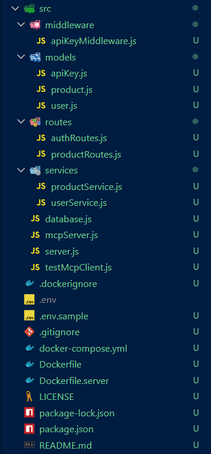
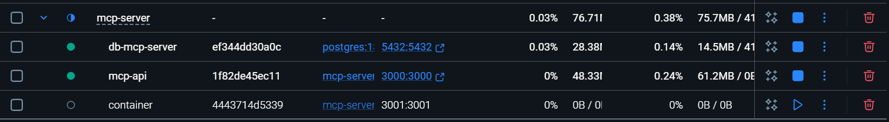

# MCP Server

A demonstration of creating a **Model Context Protocol (MCP) server** with Node.js that supports user-owned products, API key authentication, and full CRUD operations — all containerized with Docker for easy testing and deployment.

## 🚀 Overview

This project showcases a realistic MCP server setup:

- Users can register/login to obtain an API key.
- Products are associated with users and managed via full CRUD operations.
- The MCP server exposes tools via the MCP protocol, allowing clients like **LM Studio** or custom MCP clients to interact.
- Dockerized for rapid deployment and integration with other services (like PostgreSQL).

It is designed as a learning tool for building microservice-style MCP servers.

---

## 🛠️ Features

- **User authentication**: Register and login to receive an API key.
- **API key protection**: All product operations require a valid API key.
- **CRUD tools**:  
  - `list_products` — List all user products  
  - `list_product` — Get a single product  
  - `create_product` — Create a product  
  - `update_product` — Update a product  
  - `delete_product` — Delete a product  
- **Database integration**: PostgreSQL via Sequelize ORM.
- **Dockerized MCP server**: Easy local and containerized deployment.
- **Testing**: Example MCP client scripts for CRUD tool testing.

---

## 🏗️ Tech Stack

- **Node.js** (v24+)
- **Sequelize ORM** for PostgreSQL
- **PostgreSQL** for persistent storage
- **Zod** for input/output validation
- **@modelcontextprotocol/sdk** for MCP server/client
- **Docker** for containerized deployment

---

## 🏃 Getting Started (Local)

Source code coming soon.

### 📂 Source Code

`src/mcpServer.js` — MCP server with tool registration

`src/server.js` — optional HTTP server wrapper

`src/services/productService.js` — Sequelize-based CRUD

`src/testMcpClient.js` — MCP client test script

(Source code files to be provided soon - see structure below)

## Structure

This is the structure of the project:

## Author

Ethern Myth

## Licence

MIT
